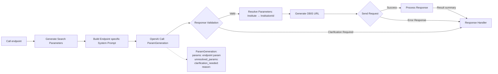

# 🌊 OBIS Natural Language Agent

Convert natural language queries into structured OBIS API calls using intelligent parsing, domain-aware embeddings, and endpoint routing built using iChatBio-SDK for https://iChatBio.org .

---

## 🚀 Overview

This project builds an intelligent agent that translates user queries like:

> *"show occurrence records of great white shark"*

into structured OBIS API requests such as:

```http
GET https://api.obis.org/v3/occurrence?scientificname=Carcharodon%20carcharias
```

The system achieves this by:

- Natural language understanding
- Smart endpoint selection
- Domain-specific entity resolution (taxa, institutes, areas)
- OBIS API integration

---

## Architecture




The agent uses GPT-4 to resolve natural language to OBIS search parameters. Common terms like country or institute names are mapped to corresponding OBIS identifiers (if any). The generated params are used to construct a OBIS url and response is captured and articualted.

### Key Tech:
- iChatBio-SDK : Agent communication and artifact management.
- OBIS : https://api.obis.org
- Pydantic : data validation for LLM response
- Langgraph : For workflow and intelligent query resolution (in progress)

---

## Getting Started

### Local Environment

```
# Create virtual environment
python3 -m venv venv
source venv/bin/activate  # On Windows: venv\Scripts\activate

# Install dependencies
pip install -r requirements.txt

# Configure environment variables
# Create a .env file with:
# OPENAI_API_KEY=your_openai_api_key_here
# or
# export OPENAI_API_KEY=your_openai_api_key_here

# Run the agent
python src/__main__.py
```

The agent is accessible at http://localhost:8990

## Docker Setup 

```
docker compose -up
```

---

## Endpoints available

- `get_occurrence`
- `checklist`
- `taxon`
- `institutes`
- `datasets`
- `statistics`
- `facet`